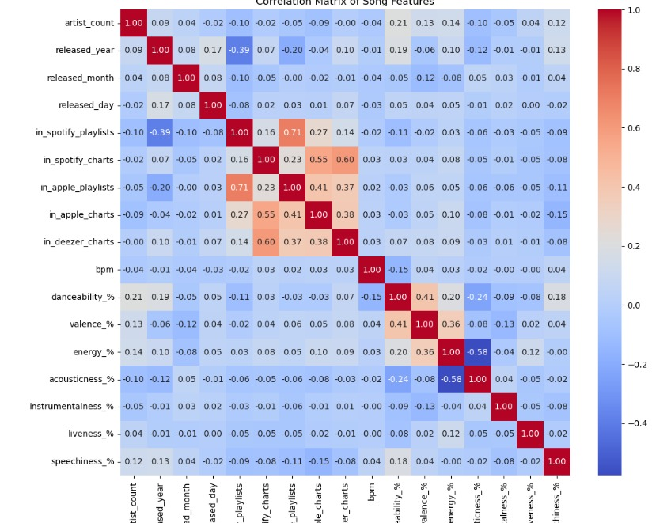

# The Anatomy of a Hit Song 🎵

## 📖 Project Overview  
This project uses machine learning to predict if a song will be successful and get into the Spotify Charts.  
I started with a complex multi-class problem and refined it into a more effective binary classification task.

---

## ❓ The Problem  
The initial goal was to predict a song's **specific chart rank** from a dataset of Popular Spotify Songs.  
However, the target variable `in_spotify_charts` was **highly imbalanced** and had many unique values.  
Direct prediction was difficult and resulted in a low-performing model.

---

## ✅ The Solution  
I pivoted to a more focused problem:  
> **Predict whether a song would make it into the charts at all** (binary `1` for “yes” or `0` for “no”).  

- Applied **data scaling** and **stratified sampling** to handle class imbalance.  
- This approach produced a **much more stable and accurate model**.
- 

---

## 🗝️ Key Learnings  
- **Problem Framing:** Simplifying the problem was key to success.  
- **Troubleshooting:**  
  - Fixed `ValueError` using **stratified sampling**.  
  - Resolved `ConvergenceWarning` by applying **data scaling**.  
- **Model Evaluation:** Learned to use **precision, recall, and the confusion matrix**, not just accuracy.

---

## 🎯 Final Model Results  
- **Accuracy:** 60%  
- **Recall for hit songs:** 94% (strong ability to identify actual hits)

---

## 🛠️ Technologies & Tools  
- **Python** – Data manipulation and modeling  
- **Pandas & NumPy** – Cleaning and preparation  
- **Scikit-learn** – Model building and evaluation  
- **Matplotlib & Seaborn** – Visualization  
- **Jupyter Notebook** – Development and documentation

---

